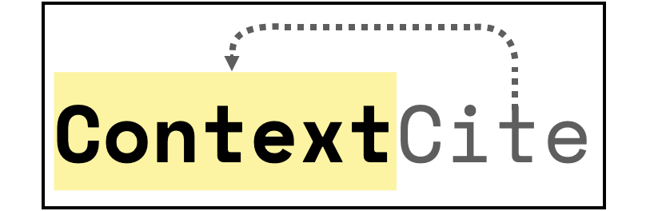
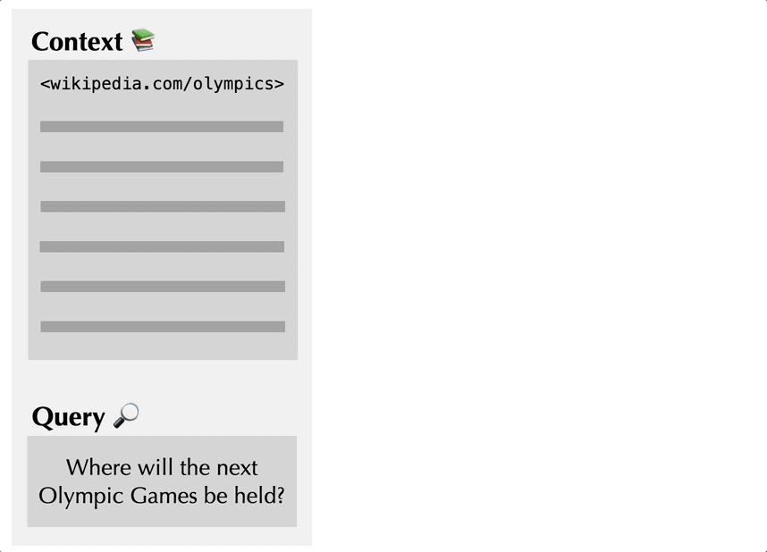
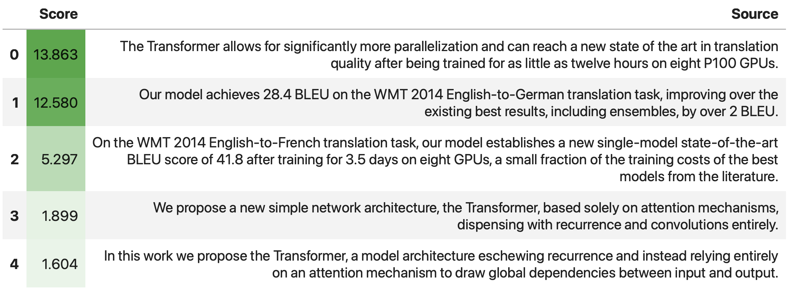
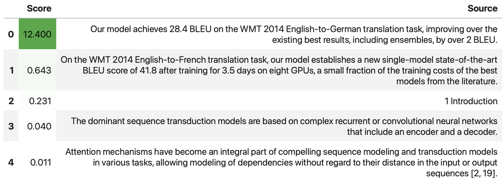

## ContextCite: Attributing Model Generation to Context
<p align='center'>
    
    <br>
    [<a href="#getting-started">getting started</a>]
    [<a href="#example-notebooks">example notebooks</a>]
    [<a href="https://huggingface.co/spaces/contextcite/context-cite">🤗 demo</a>]
    [<a href="https://gradientscience.org/contextcite/">blog post #1</a>]
    [<a href="https://gradientscience.org/contextcite-applications/">blog post #2</a>]
    [<a href="https://twitter.com/aleks_madry/status/1787564287986389277">tweet</a>]
    [paper coming soon!]
    <!-- [<a href="#citation">Citation</a>] -->
    <br>
    Maintainers: <a href="https://twitter.com/bcohenwang">Ben Cohen-Wang</a>, <a href="https://twitter.com/harshays_">Harshay Shah</a>, and <a href="https://twitter.com/kris_georgiev1">Kristian Georgiev</a>
</p>

`context_cite` is a tool for attributing statements generated by LLMs back to specific parts of the context.

<p align = 'center'>
  
</p>

## Getting started
Install `context_cite` via `pip`
```bash
pip install context_cite
```

Using `context_cite` is as simple as:

```python
from context_cite import ContextCiter

model_name = "TinyLlama/TinyLlama-1.1B-Chat-v1.0"
context = """
Attention Is All You Need

Abstract
The dominant sequence transduction models are based on complex recurrent or convolutional neural networks that include an encoder and a decoder. The best performing models also connect the encoder and decoder through an attention mechanism. We propose a new simple network architecture, the Transformer, based solely on attention mechanisms, dispensing with recurrence and convolutions entirely. Experiments on two machine translation tasks show these models to be superior in quality while being more parallelizable and requiring significantly less time to train. Our model achieves 28.4 BLEU on the WMT 2014 English-to-German translation task, improving over the existing best results, including ensembles, by over 2 BLEU. On the WMT 2014 English-to-French translation task, our model establishes a new single-model state-of-the-art BLEU score of 41.8 after training for 3.5 days on eight GPUs, a small fraction of the training costs of the best models from the literature. We show that the Transformer generalizes well to other tasks by applying it successfully to English constituency parsing both with large and limited training data.
1 Introduction
Recurrent neural networks, long short-term memory [13] and gated recurrent [7] neural networks in particular, have been firmly established as state of the art approaches in sequence modeling and transduction problems such as language modeling and machine translation [35, 2, 5]. Numerous efforts have since continued to push the boundaries of recurrent language models and encoder-decoder architectures [38, 24, 15].
Recurrent models typically factor computation along the symbol positions of the input and output sequences. Aligning the positions to steps in computation time, they generate a sequence of hidden states ht, as a function of the previous hidden state ht-1 and the input for position t. This inherently sequential nature precludes parallelization within training examples, which becomes critical at longer sequence lengths, as memory constraints limit batching across examples. Recent work has achieved significant improvements in computational efficiency through factorization tricks [21] and conditional computation [32], while also improving model performance in case of the latter. The fundamental constraint of sequential computation, however, remains.
Attention mechanisms have become an integral part of compelling sequence modeling and transduction models in various tasks, allowing modeling of dependencies without regard to their distance in the input or output sequences [2, 19]. In all but a few cases [27], however, such attention mechanisms are used in conjunction with a recurrent network.
In this work we propose the Transformer, a model architecture eschewing recurrence and instead relying entirely on an attention mechanism to draw global dependencies between input and output. The Transformer allows for significantly more parallelization and can reach a new state of the art in translation quality after being trained for as little as twelve hours on eight P100 GPUs.
"""
query = "What type of GPUs did the authors use in this paper?"
cc = ContextCiter.from_pretrained(model_name, context, query, device="cuda")
```
We can check the model's response using
`cc.response`:
```python
In [1]: cc.response
Out[1]: 'The authors used eight P100 GPUs in their Transformer architecture for training on the WMT 2014 English-to-German translation task.</s>'
```

Where did the model get its information? Let's see what the attributions look like!
```python
In [2]: cc.get_attributions(as_dataframe=True, top_k=5)
Out[2]:
```

<p align = 'center'>
  
</p>


Finally, let's try to attribute a *specific part* of the response. To do so, we specify a `start_idx` and `end_idx` corresponding to the range of the response that we would like to attribute.
In this case, we'll specify indices to attribute the phrase `"the WMT 2014 English-to-German translation task"` from the response.

```python
In [3]: cc.get_attributions(start_idx=83, end_idx=129, as_dataframe=True, top_k=5)
Out[3]:
```

<p align = 'center'>
  
</p>


## Example notebooks 

Try out `context_cite` using our example notebooks (you can open them in Google colab):
- [🤗 quickstart](https://github.com/MadryLab/context-cite/blob/main/notebooks/quickstart_example.ipynb): a quick introduction to `context_cite` <a target="_blank" href="https://colab.research.google.com/github/MadryLab/context-cite/blob/main/notebooks/quickstart_example.ipynb"> </a> 
- [🦜⛓️ RAG example](https://github.com/MadryLab/context-cite/blob/main/notebooks/rag_langchain_example.ipynb): chaining `context_cite` within a simple `langchain` RAG setup <a target="_blank" href="https://colab.research.google.com/github/MadryLab/context-cite/blob/main/notebooks/rag_langchain_example.ipynb">
  
</a>

## Citation
```bib
@misc{cohenwang2024contextcite,
  author = {Benjamin Cohen-Wang, Harshay Shah, Kristian Georgiev, Aleksander Madry},
  title = {ContextCite: Attributing Model Generation to Context},
  year = {2024},
  publisher = {GitHub},
  journal = {GitHub repository},
  howpublished = {\url{https://github.com/MadryLab/context-cite/tree/main}},
}
```
